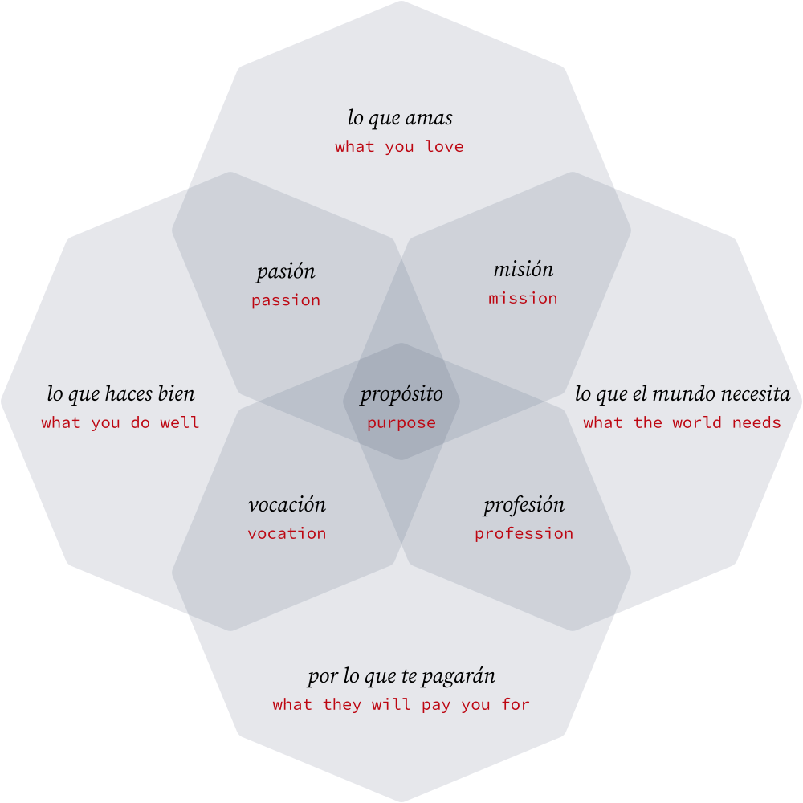

Years ago I came across this philosophy of "Ikagai" (or "reason for life") in [a
blog post][marc winn's blog post], along with an explanatory four-axis
venn-diagram[^meme seeding]. It introduced the concept of honing in on a life's
purpose by way of doing what you're good at, what you enjoy, what the world
needs, and what you can be paid for. This really resonated with me.

[^meme seeding]: Years later, Marc wrote a [follow up
post][marc winn's follow up] on the origins of his article on Ikagai and
addressed how it took on a life of its own.

I find this model a helpful tool in thinking about my own career, but it's
important to remember that it's just that: a model. While I like the framework,
as I've read more about Ikagai I also have some real concerns with it:

- It's mired in the pseudo-science of "self help" that I'm really suspicious of.
  Most books out there frame Ikagai as an elusive thing that you need to start
  searching for, won't find happiness without, and need coaching to achieve.

- It feels like yet another foreign cultural fetishization. Ikagai is a Japanese
  concept but nearly all material written on it is English.

- The origins of Ikagai's introduction to English readers is via a [TED
  talk][dan buettner's ted talk] on the unusual lives of centenarians on Okinawa
  Island which don't seem to relate to the venn-diagram, where did that come
  from?

These concerns turn out to be somewhat valid. In fact the origin of this
venn-diagram concept is not Japanese at all, but instead comes from a book by
Spanish Astrologist, [Andrés Zuzunaga]. [Marc Winn's blog post] combined this
graphic with the idea of Ikagai presented in [Dan Buettner's TED talk] and
voilà.

Despite it's shortcomings and misappropriation I still really like this mental
model for considering career progression and debugging gaps in a sense of
fulfillment. Here's my translation of Andrés Zuzunaga's original graphic in
English:

Ikagai is still a very real concept, just not the same one as presented by most
of these blog posts and books. Japanese neuroscientist Ken Mogi (who has also
written a book on Ikagai) has [a video][ken mogi's video] addressing the
venn-diagram and attempting to reclaim the term back to its original intent.

[marc winn's blog post]: https://theviewinside.me/what-is-your-ikigai/
[marc winn's follow up]: https://theviewinside.me/meme-seeding/
[dan buettner's ted talk]:
  http://www.ted.com/talks/dan_buettner_how_to_live_to_be_100
[andrés zuzunaga]: https://www.cosmograma.com/proposito.php
[ken mogi's video]: https://youtu.be/a_2RIydy_NQ
