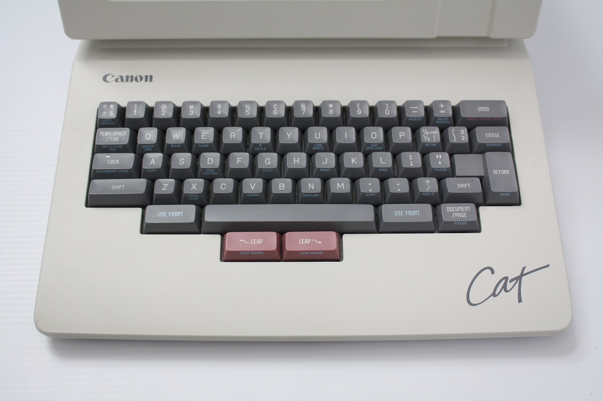

The [Canon Cat] was a computer designed by [Jef Raskin], who also dreamed up the
Apple Macintosh. Steve Jobs meddled too much in the Mac and Raskin left Apple to
create the Cat[^swyft]. It was a commercial flop, but had some awesome ideas
mostly lost to time.

[^swyft]:
    Jef Raskin started the project by founding a company, Information
    Appliances, and called the computer SWYFT: "Superb With Your Favorite
    Typing". Canon acquired his company and their marketing team came up with
    the name "Cat." No idea if Apple intentionally took a pot-shot at Jef with
    Swift.

Raskin was no fan of the computer mouse and thought keyboard driven UIs could be
much more powerful, and the Cat has a couple tricks which show that he was truly
onto something, most notably: _Leap_.

The Cat keyboard is really unique. This computer has no mouse and no arrow
keys[^creep]. Instead it has "Leap" keys under the space bar.

[^creep]:
    Arrow behavior is kinda still there. Tapping Leap on its own moves the
    cursor ahead by one. they fittingly called this "Creep". Shift+Leap would
    scroll the page up and down.

 "Credit:
https://vintagecomputer.ca/canon-cat/"

- To move around you hold down a Leap key with your thumb (in the direction you
  want to move) and start typing the thing you want to move to. The cursor moves
  in real-time with each key press.
- If you got it wrong you can hit "Undo" to go back.
- To keep looking for the same thing, hold "Use Front"[^use front] and "Leap
  Again".
- There's a dedicated "Page" button so you can Leap through page by page to
  rapidly move through a large file (or press it on its own to create a new
  blank page).
- Pressing both Leap keys highlights the text between the cursor and the
  previously leapt location. Leaping with highlighted text moves that text along
  with the cursor.

[^use front]: The "Use Front" key is essentially your "Command" key, but they
printed the commands on the front of the key caps, hence "Use Front".

This is so different from what we're used to that it seems like it might be
frustrating to use and rightfully part of history instead of current kit, but I
find this inspiring. I wish I could get my computer to work this way!

I've been using VIM exclusively the last few weeks and trying to get used to it.
I'm realizing that I spend way more time _moving around_ then I actually do
typing new things. I've come to really appreciate the `/` and `?` commands which
search ahead and back for some text to move towards. It's very powerful, but
slightly awkward to use, so I find myself not using it as much as I should.
Having that functionality under my thumbs would feel like a super power.

There aren't that many Canon Cats still floating around, but if you want to get
a feel for what using one of these is like, you can run its
[software in emulation mode](https://archive.org/details/canoncat) thanks to the
Internet Archive! How to use this is not very clear, but here's what I figured
out so far:

- option keys (left and right) are Jump
- `\` key is Undo
- control is "Use Front"
- Full screen the emulator to immerse yourself!

Obviously, it's not quite the same as having the Cat keyboard in front of you,
but I still found it very curious to use and gave me confidence that this could
be an easily learned and very fun to use digital world to live in.

There are surprisingly almost no modern tools that reference back to Leap and
the Canon Cat. One notable one is the [Left] text editor by Hundred Rabbits,
which very recently
[added Leap](https://twitter.com/hundredrabbits/status/1466832328462790656?s=21).

Here are some resources with a lot more content, digitized instruction manuals,
history, and other bits and bobs down this particular rabbit hole:

- [canoncat.net](http://www.canoncat.net/)
- [canoncat.org](https://www.canoncat.org/)
- [Canon Cat on old-computers.com](https://www.old-computers.com/museum/computer.asp?st=1&c=642)
- [The Humane Interface](https://en.wikipedia.org/wiki/The_Humane_Interface)

Finally, I'll leave you with this convincing promotional video showing off the
Cat in use, showing both more of what it can do[^calc] as well as some truly
excellent '80s hairstyles.

[^calc]:
    Like running calculations (or code!) live in a document with a key press
    instead of having a dedicated calc app. Really cool ideas.

<YouTube v="o_TlE_U_X3c" aspectRatio={4 / 3} />

[canon cat]: https://en.wikipedia.org/wiki/Canon_Cat
[jef raskin]: https://en.wikipedia.org/wiki/Jef_Raskin
[left]: https://100r.co/site/left.html
