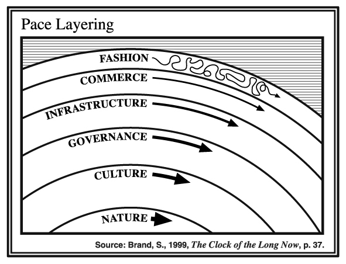
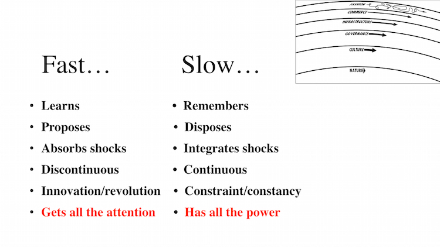

Stewart Brand[^1], in his book The Clock of Long Now, described the concept of
pace layers: that within a society different groups move at different speeds.
The relationship between layers creates both internal tension and desirable
systemic effects, allowing for society to innovate and disrupt while
simultaneously providing consistency and stability.

This is a mental model and framework for understanding society at large, but
applies equally well for many large dynamic systems of people, software,
architecture, and nature. Faster layers tend to be at the visible surface and
change discontinuously, innovating when faced with new input. Slower layers are
more powerful, integrating and codifying lessons from faster layers while
providing inertial continuity that constrains them.

When struggling to weigh fast with slow, balancing allowing change with
providing continuity, consider how Pace Layers can help you think about the
system you're working within.

To change is to lose identity; yet to change is to be alive[^2]

[^1]:
    [Stewart Brand](https://en.wikipedia.org/wiki/Stewart_Brand) is an overall
    fascinating and polarizing person. 1960s San Francisco counter-culture
    leader, editor of the Whole Earth Catalog, president of the Long Now
    Foundation, and friend of Douglas Engelbart, Steve Jobs, Buckminster Fuller,
    and Brian Eno.

[^2]:
    This and many other great moments from Brand's
    [lecture](https://longnow.org/ideas/pace-layers-stewart-brand-paul-saffos-conversations-at-the-interval/)
    at The Long Now's Interval.
