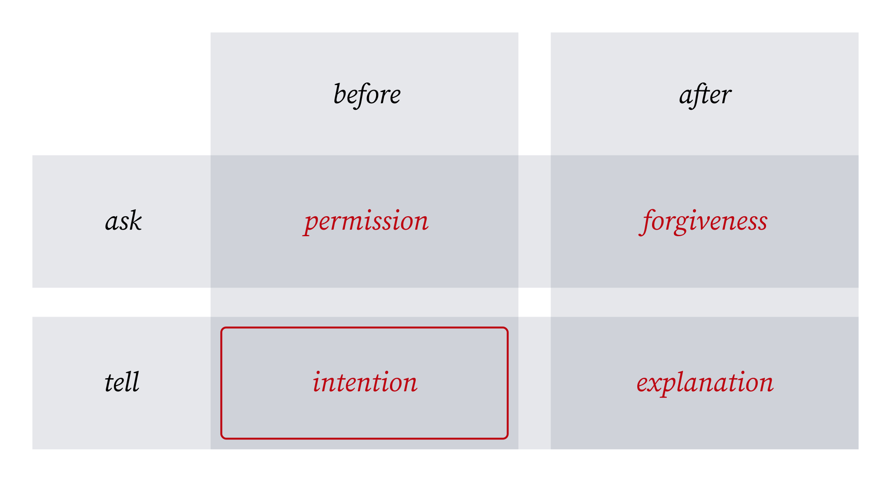

> It's easier to ask forgiveness than it is to get permission. — Grace
> Hopper[^1]

[^1]:
    This advice as quoted was popularized by all around badass Grace Hopper.
    However various forms
    [have been cited](https://quoteinvestigator.com/2018/06/19/forgive/), back
    as far as St. Benedict in 500 AD. Likely some form of it has existed as long
    as there has been organized human society.

This is classic advice when operating in a large organization. You see a problem
to be solved, have a bold solution in mind, and have everything necessary to
take action, but there will be very real costs felt broadly. You think the
tradeoff is worth it, but will your higher-ups agree or will they simply blame
you for the costs without appreciating the larger problem solved?

In this position you likely have the best information on the decision but may
assume you need permission to incur the costs. If your higher-ups assume the
same then analysis paralysis sets in and it's unlikely you'll hear anything new
that changes your original assessment. If it's a good idea, _go ahead and do
it_. Grace Hopper encouraged a bias to action; to do the right thing for the org
whether or not they know it to be. If you're wrong or get flak for the costs:
ask forgiveness; you acted in good faith.

This is good advice missing one critical thing: _radiating intent_.

While "forgiveness, not permission" considers what you're asking, it says
nothing about what you're telling. If you anticipate needing to ask forgiveness
after taking action then its best to get ahead of it by explaining the decision
clearly immediately after you've made it. Even better, explain the decision
_before_ you make it then radiate it, sharing it far and wide.

With this frame in mind it becomes more clear that rather than shifting your ask
from before until after you act, instead shift from asking to telling.

Elizabeth Ayer, in her
[excellent article](https://medium.com/@ElizAyer/dont-ask-forgiveness-radiate-intent-d36fd22393a3)
on radiating intent explains why it's superior to asking forgiveness (or
permission), which I've editorialized:

- Invites participation from those with critical information or a desire to help
- In case you're wrong, it gives a chance for someone to stop you _before_ hand
- Leaves evidence of good faith action. Better to be seen as predictable than
  underhanded.
- Sets the example that bold action and taking risks is encouraged from
  everyone, not just organizational higher-ups.
- Keeps responsibility on the actor who owns the outcome good or bad. Doesn’t
  transfer blame as seeking permission does.

If it's a good idea, go ahead and do it. Own the outcome. _Radiate intent!_
