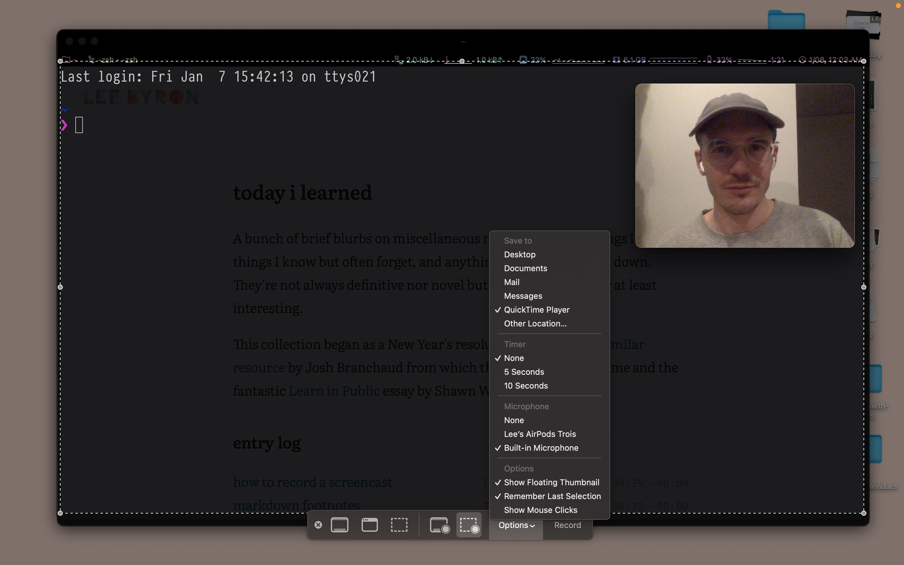

There's plenty of good software out there for screencasting, but if you're in
a pinch Quicktime Player does a solid job with a bit of prep.

1. Get a clear desktop and open all windows you want to screencast, not full
   screened. Also open Quicktime Player.

   - Don't forget to increase font size in any terminals, browsers, or IDEs to
     increase visibility. 100 columns works okay.

1. **File → New Movie Recording**

   Don't actually record a movie. This just abuses the webcam preview so you can
   have your face in the screen cast. Resize the window down and position it in
   the corner of your desktop.

1. **File → New Screen Recording**

   - Choose the "Record Selected Portion" and resize the area to be 1280×720 (or
     a large size of the same aspect ratio if your screen allows).
   - You can't move windows around while resizing the recording area, but you
     can during recording. If necessary, start a recording to get windows all
     lined up.
   - Open options and make sure your microphone is on.
   - Record! Press ⌘⌃esc to stop. Trim the resulting video.

